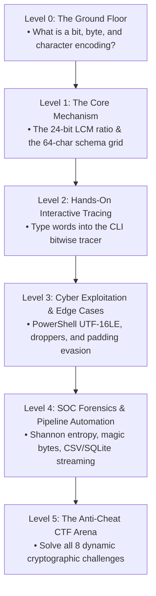

# Start Here: The 0-to-100 Cybersecurity Base64 Curriculum

> **The Structured Learning Pathway: How to Master Base64 from Absolute Zero to Senior SOC Analyst**  
> *Follow this exact sequence to learn as quickly and effectively as possible without feeling overwhelmed.*

---

## 🧭 The Learning Roadmap at a Glance



---

## 🟢 Level 0: The Ground Floor (Prerequisites)

If you have never studied binary or low-level computing, start here.

### 1. What is a Bit?
* A **bit** (binary digit) is the smallest unit of digital information. It has only two possible states: `0` or `1`.
* Think of it as a microscopic light switch: `0` = OFF, `1` = ON.

### 2. What is a Byte (Octet)?
* Computers group bits into **bytes** (also called **octets** in networking).
* Exactly **8 bits = 1 byte**.
* With 8 bits, you can represent $2^8 = 256$ possible values (from $0$ to $255$).
* Example: The number `65` in binary is `01000001`.

### 3. What is Character Encoding (ASCII)?
* Computers only understand numbers, not letters.
* **ASCII** is an agreed-upon standard lookup table that assigns letters to numbers:
  * Number `65` $\rightarrow$ `'A'`
  * Number `97` $\rightarrow$ `'a'`
  * Number `72` $\rightarrow$ `'H'`
  * Number `101` $\rightarrow$ `'e'`

### 4. Why Binary-to-Text Encoding is Needed
* Early protocols (Email, HTTP, IRC) were built for printable text.
* If you send a binary file (an image, a PDF, an executable), it contains byte values like `0x00` (null byte) and control characters that corrupt text parsers.
* **Base64 converts any binary file into safe, printable letters and numbers.**

---

## 🟡 Level 1: The Core Mechanism (The Math)

* **What to read first:** [docs/05_BASE64_CHEAT_SHEET_AND_VISUALIZER.md](05_BASE64_CHEAT_SHEET_AND_VISUALIZER.md)
* **What you will learn:**
  1. The **Least Common Multiple (LCM)** of 8-bit bytes and 6-bit chunks is **24 bits**.
  2. Every 3 raw bytes ($3 \times 8 = 24$ bits) expand into 4 safe ASCII characters ($4 \times 6 = 24$ bits).
  3. Why Base64 always causes a **33.3% increase in file size**.
  4. How the 64-character lookup schema works (values 0–63).
  5. The three padding rules: why `"Cat"` has no padding, `"Hi"` gets one `=`, and `"A"` gets two `==`.

---

## 🟠 Level 2: Hands-On Interactive Tracing

Now, open your terminal and see the math execute live on your own machine.

```bash
# Trace a standard word
python b64lab.py trace "Hello"

# Trace your own name
python b64lab.py trace "YourName"
```

* **What you will see:** The terminal breaks down every letter into its 8-bit octets, combines them into a 24-bit shift buffer, slices them into 6-bit sextets, and looks up the characters in real-time.

---

## 🔵 Level 3: Cyber Exploitation & Edge Cases

* **What to read:** [docs/02_MALWARE_OBFUSCATION.md](02_MALWARE_OBFUSCATION.md)
* **What to practice in B64Lab:**
  1. **PowerShell UTF-16LE Gotcha:**
     ```bash
     # Forge a PowerShell payload and compare UTF-8 vs UTF-16LE
     python b64lab.py ps "whoami"
     ```
     *Learn why Windows PowerShell expects alternating 0x00 null bytes.*
  2. **Multi-Stage Droppers:** Launch the Offensive Forge (`python b64lab.py` $\rightarrow$ Menu `[3]`) and build a nested GZIP + Base64 stager.
  3. **Custom Alphabet Ciphers:** See how threat actors swap the 64 characters to bypass static antivirus rules.

---

## 🟣 Level 4: SOC Forensics & Enterprise Automation

* **What to read:** [docs/03_SOC_TRIAGE_FORENSICS.md](03_SOC_TRIAGE_FORENSICS.md)
* **What to practice in B64Lab:**
  1. **Shannon Entropy Threat Scoring:**
     ```bash
     python b64lab.py entropy "TVqQAAMAAAAEAAAA//8AALgAAAAAAAAAQAA"
     ```
     *Learn why Base64 clusters reliably between 5.10 and 5.95 bits/symbol.*
  2. **Magic Byte Identification:** Discover how incident responders identify disguised `.exe`, `.pdf`, `.zip`, and `.elf` files hiding behind Base64.
  3. **Enterprise Pipeline Carving:**
     ```bash
     # Carve an entire log file to an Excel CSV spreadsheet
     python b64lab.py carve samples/sample_web_access.log --format csv -o triage.csv

     # Carve to an indexed SQLite database for SQL queries
     python b64lab.py carve samples/sample_web_access.log --format sqlite -o triage.db
     ```

---

## 🏆 Level 5: The Anti-Cheat CTF Challenge Arena

Now put everything together in the hands-on arena.

```bash
# Launch interactive terminal
python b64lab.py
# Select [4] CTF CHALLENGES
```

* **Anti-Cheat Hardened:** Your session generates unique, cryptographically salted HMAC-SHA256 flags. You cannot find the answers on Google or by grepping the source code.
* **Progressive Difficulty:**
  * Level 1: Basic Token Decoding
  * Level 2: Repairing Stripped Padding (`=`)
  * Level 3: De-obfuscating PowerShell UTF-16LE
  * Level 4: Carving Access Logs
  * Level 5: Magic Byte Identification (`MZ`)
  * Level 6: Decompressing Nested GZIP Droppers
  * Level 7: Reversing a Custom Threat Alphabet
  * Level 8: Live C2 Incident Triage
