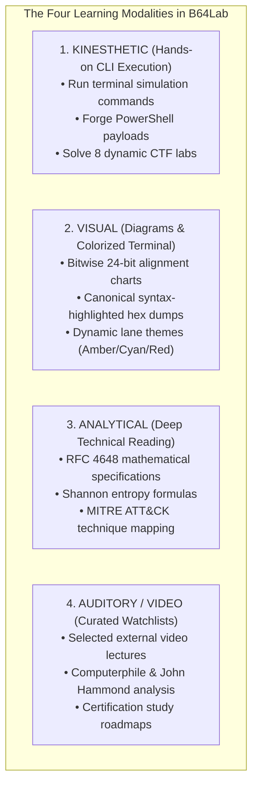

# Why B64Lab Exists: The Mission, The Landscape & The Gap

> **The Origin Story, Architectural Philosophy & The Problem Solved**  
> *"From zero understanding to assembly-level mastery and automated forensic operations."*

---

## 1. The Origin Story: A Student's Hands-On Journey

**B64Lab** was born out of a real problem experienced during cybersecurity training.

When studying for security certifications (CompTIA Security+, CySA+, BTL1, OSCP, PNPT), virtually every student encounters Base64. You see it in:
* Web tokens (JSON Web Tokens / JWTs)
* Phishing emails (MIME attachments)
* Windows Event logs (PowerShell `-EncodedCommand`)
* Malware droppers and C2 beacons

However, traditional tutorials only teach the superficial layer:
```python
import base64
print(base64.b64decode("SGV5"))
```

### The Frustration
In the real world, an incident responder or penetration tester never encounters clean, isolated 4-character strings:
* You encounter **50 MB noisy web server logs** with encoded SQLi payloads buried in query strings.
* You encounter **PowerShell UTF-16LE scripts** where standard ASCII decoding produces corrupt null bytes.
* You encounter **multi-stage droppers** where Base64 wraps GZIP, which wraps another Base64 layer, which conceals a Windows PE executable.
* You encounter **attackers who strip padding (`=`)** or permute the 64-character alphabet to bypass detection rules.

Existing educational content was either too theoretical (dense RFC mathematics without code) or too trivial (10-line Python scripts). **B64Lab was built to be the all-in-one platform I wished existed when I started: an interactive lab that takes anyone from absolute zero to deep forensic competence through multiple learning styles.**

---

## 2. The Tool Landscape: What Existed vs. The Gap Filled

Before B64Lab, security practitioners relied on a fragmented set of tools:

```
THE EXISTING TOOLING LANDSCAPE
┌─────────────────────────────────────────────────────────────────────────────┐
│  CYBERCHEF              BASE64DUMP.PY           CIPHEY                      │
│  (GCHQ Web App)         (Didier Stevens CLI)    (Cryptanalysis Engine)      │
│  ─────────────────      ────────────────────    ──────────────────────      │
│  ✓ Swiss-Army knife     ✓ Good for carving      ✓ Heuristic decryption      │
│  ✗ Generic utility      ✗ Cryptic CLI flags     ✗ General cryptography      │
│  ✗ Doesn't teach cyber  ✗ Zero learning lab     ✗ No threat context         │
│  ✗ Heavy browser app    ✗ Zero offensive sim    ✗ Heavy ML dependencies     │
└─────────────────────────────────────────────────────────────────────────────┘
                                      │
                                      ▼
┌─────────────────────────────────────────────────────────────────────────────┐
│                              THE B64LAB GAP                                 │
│  1. ACADEMY (0-to-100 Education): Visual bitwise math, RFC 4648, padding.   │
│  2. BLUE LANE (Triage & Forensics): Shannon entropy, magic bytes, carver.   │
│  3. RED LANE (Offensive Simulation): PowerShell UTF-16LE, droppers, evasion.│
│  4. CTF ARENA: Dynamic cryptographic anti-cheat challenges with auto-score. │
│  5. ZERO-DEPENDENCY: Pure Python standard library, air-gap ready.           │
└─────────────────────────────────────────────────────────────────────────────┘
```

### Direct Competitive Comparison

| Feature / Capability | GCHQ CyberChef | Didier Stevens `base64dump.py` | Ciphey | **B64Lab** |
| :--- | :---: | :---: | :---: | :---: |
| **Air-Gapped CLI (No Browser Required)** | ❌ | ✅ | ✅ | **✅ (Pure Stdlib)** |
| **Zero Third-Party Dependencies** | ❌ (Web) | ✅ (Python) | ❌ (Many wheels) | **✅ (100% Built-in)** |
| **Interactive Educational Lessons** | ❌ | ❌ | ❌ | **✅ (0-to-100 Academy)** |
| **Visual 24-Bit Bitwise Step-Through** | ❌ | ❌ | ❌ | **✅ (Interactive Tracer)** |
| **PowerShell UTF-16LE Auto-Detection** | ❌ (Manual) | ❌ | ❌ | **✅ (Native Subsystem)** |
| **Shannon Entropy Anomaly Scoring** | Manual Recipe | ❌ | Partial | **✅ (Colorized Meter)** |
| **Magic Byte Signature Identification** | Manual Recipe | ❌ | ❌ | **✅ (PE/ELF/PDF/ZIP/GZ)** |
| **Recursive Multi-Stage Dropper Unpacker** | Manual Recipe | ❌ | Partial | **✅ (Recursive Engine)** |
| **Adversary Payload Forge & Evasion** | ❌ | ❌ | ❌ | **✅ (Red Team Lane)** |
| **Dynamic Anti-Cheat CTF Challenge Arena**| ❌ | ❌ | ❌ | **✅ (HMAC-SHA256)** |

---

## 3. Adapting to All Learning Styles

People do not absorb technical knowledge the same way. B64Lab is intentionally designed with a **four-pillar multi-modal learning architecture**:



### 1. The Kinesthetic Learner (Learning by Doing)
* Launch the CLI, forge your own PowerShell UTF-16LE payloads, carve noisy web server access logs, and input flags into the built-in CTF Arena.

### 2. The Visual Learner (Learning by Seeing)
* View real-time bitwise transformations where binary bits (`01001101...`) are split into four 6-bit sextets before your eyes.
* Terminal borders and prompts dynamically shift color: **Amber** for Academy, **Neon Ice Blue** for Defensive Triage, and **Tactical Crimson** for Offensive Simulation.

### 3. The Analytical / Reading Learner (Learning by Deconstructing)
* Comprehensive architectural guides in `docs/` detailing the exact CPU bit-shifts, padding proofs, and malware reverse-engineering techniques.

### 4. The Auditory & External Learner (Learning by Watching & Listening)
* Curated video recommendations, official RFC links, and security research papers documented in `docs/04_LEARNING_PATHWAYS_AND_RESOURCES.md`.

---

## 4. The Dual Philosophy: Fundamental Theory + Automated Tooling

Knowing how to calculate Base64 by hand on a whiteboard is essential for passing technical interviews and understanding edge-case bugs. But when a live ransomware incident strikes at 2:00 AM, analysts cannot decode 50,000 log lines by hand.

B64Lab balances both:
1. **The Fundamentals:** Teaches the bit-level math so you understand *why* things work and *why* they break.
2. **The Automation:** Provides automated tools (carver, recursive unpacker, entropy scorer) that perform in 2 milliseconds what would take 20 minutes manually.
