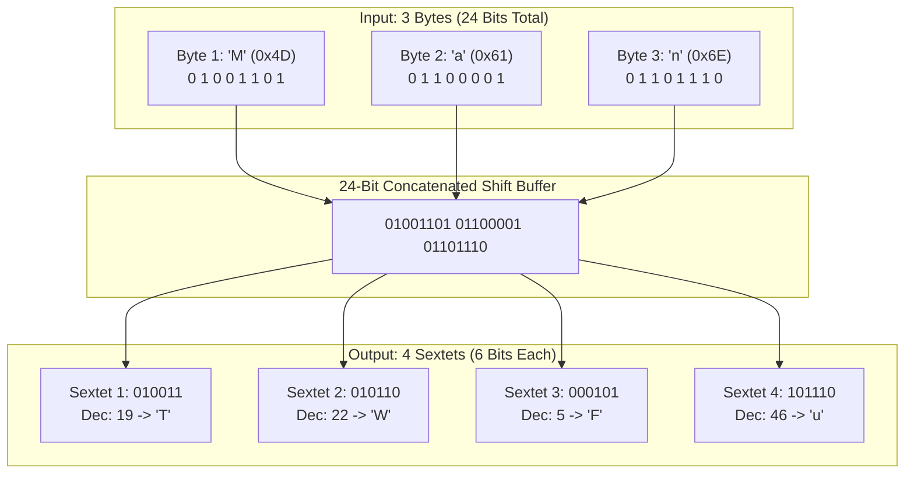
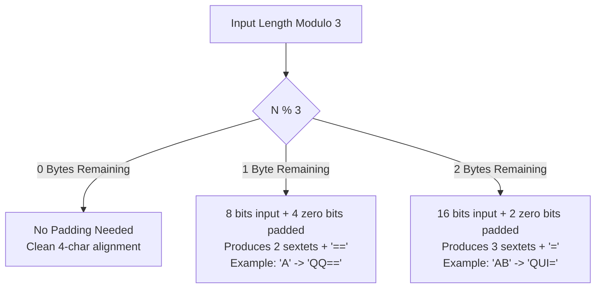

# Module 1: Low-Level Bitwise Architecture & RFC 4648

> **Architectural Specification & Mechanical Deep-Dive**  
> *Target Audience: Reverse Engineers, Exploit Developers, and Security Researchers*

---

## 1. The Core Problem: Why Base64 Exists

Early communication protocols (SMTP, HTTP, Usenet, JSON, XML) were engineered around **7-bit or 8-bit ASCII characters**. Binary files (executables, PDFs, compressed archives, encrypted tokens) contain raw byte values from `0x00` to `0xFF`.

When raw binary streams pass through text-only transmission channels:
1. Null bytes (`0x00`) are treated as string terminators by C-based parsers.
2. Control characters (`0x0D`, `0x0A`, `0x1B`, `0x04`) trigger line-breaks, EOF markers, or escape sequences.
3. High-order bits (`> 0x7F`) are stripped or distorted by 7-bit gateways.

**RFC 4648 Base64** converts arbitrary 8-bit binary octets into a strictly printable 64-character subset of ASCII.

---

## 2. The 24-Bit Bitwise Transformation Pipeline

Base64 works on a fundamental mathematical ratio:
$$\text{LCM}(8 \text{ bits}, 6 \text{ bits}) = 24 \text{ bits}$$

Three 8-bit bytes ($3 \times 8 = 24$ bits) map cleanly into four 6-bit chunks ($4 \times 6 = 24$ bits):



### CPU-Level Bit-Shift Implementation

In `b64lab.core.bitwise`, the transformation is computed directly using bitwise operators:

```python
# 1. Pack 3 bytes into a single 24-bit integer
buffer24 = (b1 << 16) | (b2 << 8) | b3

# 2. Extract 4 sextets using bitwise right-shifts and 6-bit mask (0x3F = 00111111)
c1 = alphabet[(buffer24 >> 18) & 0x3F]
c2 = alphabet[(buffer24 >> 12) & 0x3F]
c3 = alphabet[(buffer24 >> 6)  & 0x3F]
c4 = alphabet[buffer24         & 0x3F]
```

---

## 3. The Mathematics of Padding (`=` and `==`)

Input streams rarely divide evenly by 3 bytes. When data ends on a non-multiple of 3, padding is mathematically mandatory to preserve bit alignment:



### The Adversary Padding Stripping Trick
Threat actors frequently strip trailing `=` characters:
* A standard regex looking for `^[A-Za-z0-9+/]{4}*={0,2}$` fails to match unpadded tokens.
* Modern decoders (including `b64lab.triage.carver`) normalize padding using:
  ```python
  remainder = len(s) % 4
  if remainder == 2: s += "=="
  elif remainder == 3: s += "="
  # remainder == 1 is mathematically impossible for valid Base64
  ```

---

## 4. RFC 4648 Standards Matrix

| Standard | Bits / Symbol | Chars | Delimiters | Primary Use Cases |
| :--- | :--- | :--- | :--- | :--- |
| **Base64** (Sec 4) | 6 bits | 64 | `+`, `/`, `=` | MIME, X.509 Certificates, Dropper Staging |
| **Base64URL** (Sec 5) | 6 bits | 64 | `-`, `_`, optional `=` | JSON Web Tokens (JWT), URL Query Strings |
| **Base32** (Sec 6) | 5 bits | 32 | `A-Z`, `2-7`, `=` | TOTP Authenticator Keys, DNS Tunneling |
| **Base16** (Sec 8) | 4 bits | 16 | `0-9`, `A-F` | Hex dumps, Hash signatures (MD5/SHA) |
