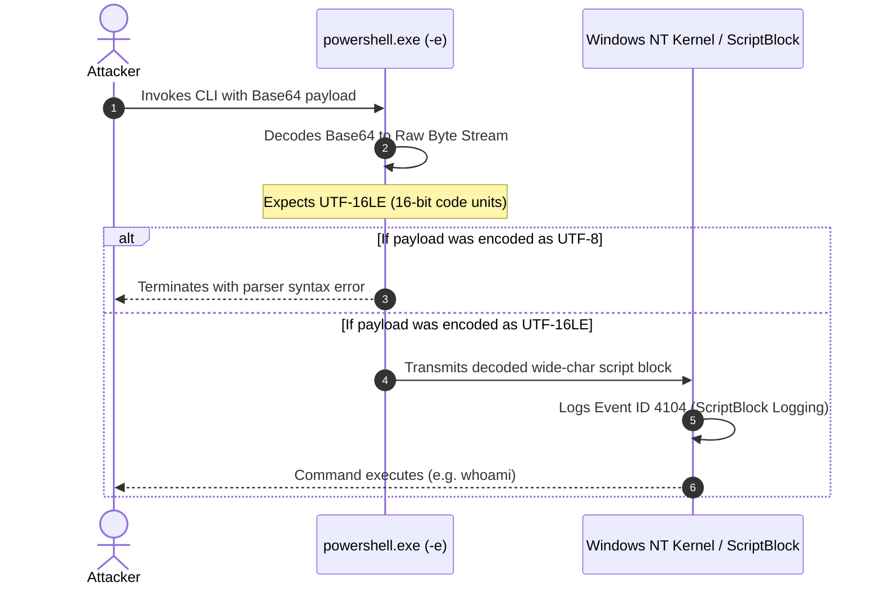
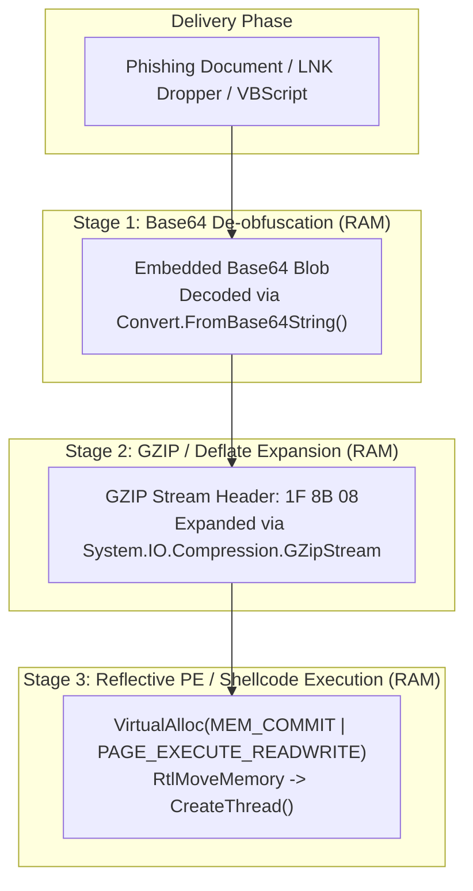

# Module 2: Adversary Tradecraft & Malware Obfuscation

> **Threat Actor Emulation, Living-off-the-Land (LotL), and Defense Evasion**  
> *Target Audience: Red Team Operators, Penetration Testers, and Detection Engineers*

---

## 1. PowerShell -EncodedCommand: The UTF-16LE Gotcha

Living-off-the-Land (LotL) attacks frequently invoke Windows PowerShell using the `-EncodedCommand` switch (or `-e`, `-enc`):

```powershell
powershell.exe -NoProfile -NonInteractive -ExecutionPolicy Bypass -EncodedCommand <BASE64_STRING>
```

### The Architectural Trap
Windows NT internal APIs represent Unicode strings as **UTF-16LE (Little Endian)**, allocating **2 bytes per character**.
Standard Linux and modern web applications use **UTF-8**, allocating **1 byte per standard ASCII character**.

```
Command: 'whoami'

[UTF-8 Byte Sequence] (6 Bytes):
  77 68 6F 61 6D 69
  -> Base64: "d2hvYW1p"
  -> PowerShell Result: FAILS! Windows cannot parse UTF-8 as an EncodedCommand.

[UTF-16LE Byte Sequence] (12 Bytes - Alternating 0x00 null bytes):
  77 00 68 00 6F 00 61 00 6D 00 69 00
  -> Base64: "dwBoAG8AYQBtAGkA"
  -> PowerShell Result: EXECUTES NATIVELY!
```



---

## 2. Multi-Stage Droppers & Memory Staging

Commodity trojans, loaders, and C2 beacons (Cobalt Strike, Sliver) avoid storing raw binaries on disk. Instead, they utilize a multi-layered de-obfuscation pipeline in volatile memory:



### Why Adversaries Chain Compression + Encoding:
1. **Entropy Masking:** Direct high-entropy shellcode ($H > 7.4$) triggers EDR heuristics. Wrapping it in structured layers normalizes static entropy.
2. **Payload Footprint:** GZIP reduces compiled PE binaries by up to 70%, facilitating evasion of email attachment size limits.
3. **Static Signature Invalidation:** String scanning rules looking for `kernel32.dll` or `VirtualAlloc` fail against compressed/encoded layers.

---

## 3. Custom Alphabet Substitution Ciphers

In standard RFC 4648 Base64, recognizable file headers produce predictable character sequences:
* A Windows PE Executable (`MZ`, `0x4D 0x5A`) begins with **`TVq`** or **`TVo`**.
* A Linux ELF Executable (`\x7fELF`) begins with **`f0VM`**.
* A PDF document (`%PDF-`) begins with **`JVBERi`**.

Advanced Persistent Threat (APT) groups (e.g. APT29, FIN7) break these static detection signatures by permuting the 64-character alphabet:

```
Standard Alphabet:
ABCDEFGHIJKLMNOPQRSTUVWXYZabcdefghijklmnopqrstuvwxyz0123456789+/

Reversed Threat Table:
/+9876543210zyxwvutsrqponmlkjihgfedcbaZYXWVUTSRQPONMLKJIHGFEDCBA
```

With the custom substitution table applied, `MZ` transforms into unidentifiable characters, blinding static AV scanners while retaining reversible decoding on the target endpoint.
