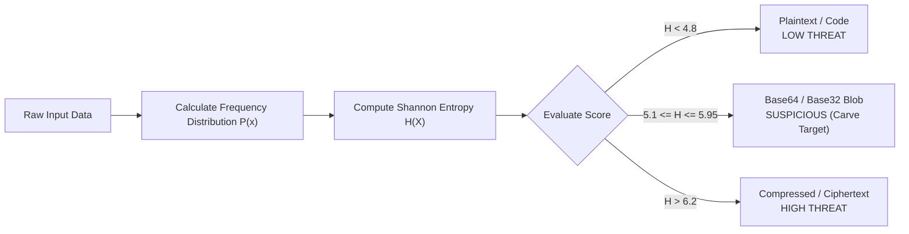

# Module 3: Defensive Triage & Forensic Carving

> **Mathematical Anomaly Detection, Magic-Byte Carving, and Incident Response Triage**  
> *Target Audience: SOC Analysts, Incident Responders, and Threat Hunters*

---

## 1. Shannon Entropy: Mathematical Threat Hunting

**Shannon Entropy** quantifies the degree of randomness or information density in a sequence of bytes. Measured on a scale from $0.00$ to $8.00$ bits per symbol:

$$H(X) = -\sum_{i=1}^{n} P(x_i) \log_2 P(x_i)$$

```
Entropy Distribution Spectrum (Bits / Symbol)
├──────────┼──────────────┼─────────────────────────┼────────────────────────┤
0.0        3.5            5.1                       6.2                      8.0
(Nulls)    (Plaintext)    (BASE64 ENCODING CLUSTER)  (Compressed / Encrypted)
```



### Why Base64 Clusters Between 5.10 and 5.95
Because Base64 maps data into an evenly distributed 64-symbol alphabet ($2^6 = 64$), its theoretical maximum entropy is $\log_2(64) = 6.00$. In practice, typical Base64 payloads cluster tightly between **5.10 and 5.95**, creating a high-fidelity signature for SIEM/EDR filters.

---

## 2. Magic Byte Signatures: File Carving Reference

When carving embedded Base64 strings from network traffic, web logs, or memory dumps, defenders decode the stream in-memory and inspect the first 4–8 bytes (the **Magic Bytes**):

| Extension | Category | Magic Bytes (Hex) | ASCII Equivalent | Base64 Marker |
| :--- | :--- | :--- | :--- | :--- |
| `.exe` / `.dll` | Executable | `4D 5A` | `MZ` | `TVq...` / `TVo...` |
| `.elf` | Executable | `7F 45 4C 46` | `\x7fELF` | `f0VM...` |
| `.pdf` | Document | `25 50 44 46` | `%PDF-` | `JVBERi...` |
| `.zip` / `.docx` | Archive | `50 4B 03 04` | `PK\x03\x04` | `UEsDBA...` |
| `.gz` | Compression | `1F 8B 08` | `\x1f\x8b\x08` | `H4sI...` |
| `.png` | Image | `89 50 4E 47` | `\x89PNG` | `iVBORw...` |

---

## 3. Log Carving: Windows Events & Web Servers

### Windows Event ID 4104 (ScriptBlock Logging)
Attackers frequently invoke Base64 encoded scripts. The forensic carver identifies the encoded blob, extracts the UTF-16LE bytes, and reconstructs the underlying script block without executing it.

### Web Server Access Logs (Apache / Nginx / IIS)
Attackers inject Base64 commands into HTTP query parameters, headers, or cookies:

```
# Raw Incident Log Line:
192.168.1.105 - - [03/Sep/2026:14:22:01] "POST /api/sync?token=PD9waHAgc3lzdGVtKCRfR0VUWydjbWQnXSk7ID8+ HTTP/1.1" 200 512

# Carving Process:
1. Regex match token: 'PD9waHAgc3lzdGVtKCRfR0VUWydjbWQnXSk7ID8+'
2. Shannon Entropy: 5.48 (Matches Base64 cluster)
3. Decoded: '<?php system($_GET['cmd']); ?>'
4. Incident Classification: Webshell Injection (T1505.003)
```

---

## 4. Defanged Payload Export Protocol

Incident responders follow strict handling standards when exporting carved artifacts:
1. **Hash Calculation:** Generate MD5 and SHA-256 digests immediately.
2. **Defanging Indicators:** Replace active schemes (`hxxps://`, `192[.]168[.]1[.]105`).
3. **Quarantine Containment:** Write binary payloads into an isolated directory with execution permissions revoked (`chmod -x` or non-executable storage).
