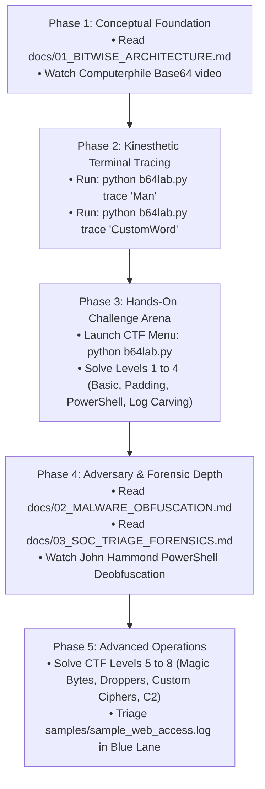

# Learning Pathways & Curated Cybersecurity Resources

> **The Multi-Modal Study Roadmap: Videos, RFCs, Tool References, and Certification Alignment**  
> *Target Audience: Students, Self-Taught Hackers, SOC Analysts, and Certification Candidates*

---

## 1. The Multi-Modal Study Roadmap

To maximize retention, do not just read this documentation or just run terminal commands. Follow this multi-modal study loop:

---

## 2. Curated High-Yield Video Lectures

For auditory and visual learners, these selected external videos provide incredible depth and directly reinforce B64Lab modules:

### 1. Computer Science & Bitwise Fundamentals
* **[Computerphile: Base64 (and why 64?)](https://www.youtube.com/watch?v=g_aC546S2Go)**
  * *Why watch:* Dr. Mike Pound visually demonstrates on paper how 3 bytes of 8 bits map into 4 characters of 6 bits, and why padding exists.
  * *Directly maps to:* B64Lab Module 1 & `docs/01_BITWISE_ARCHITECTURE.md`.

### 2. Real-World Malware De-Obfuscation
* **[John Hammond: Analyzing Obfuscated PowerShell Droppers](https://www.youtube.com/watch?v=0kF5lX3e1kU)**
  * *Why watch:* Demonstrates how real-world malware uses `-EncodedCommand` and layered compression to hide payloads from incident responders.
  * *Directly maps to:* B64Lab Module 3 & `docs/02_MALWARE_OBFUSCATION.md`.

### 3. Binary Data, Encodings vs. Encryption
* **[LiveOverflow: Encoding vs Encryption (Why Base64 is Not a Cipher)](https://www.youtube.com/watch?v=s0bHjL4p_f8)**
  * *Why watch:* Clarifies the classic junior interview trap: encoding transforms data representation for transport; it provides zero confidentiality!
  * *Directly maps to:* B64Lab Glossary & `b64lab.academy.glossary`.

---

## 3. Official Standards & RFC Specifications

Senior engineers and forensic specialists read the raw standards. Bookmark these canonical RFCs:

* **[RFC 4648 - The Base16, Base32, and Base64 Data Encodings](https://datatracker.ietf.org/doc/html/rfc4648)**
  * *The authoritative standard:* Defines the 64-char alphabet, URL-safe variant (Section 5), Base32 (Section 6), and padding rules (Section 4.3).
* **[RFC 2045 - Multipurpose Internet Mail Extensions (MIME) Part One](https://datatracker.ietf.org/doc/html/rfc2045)**
  * *Origin of Base64 in email:* Section 6.8 specifies Content-Transfer-Encoding: base64 for email attachments.
* **[RFC 7519 - JSON Web Token (JWT)](https://datatracker.ietf.org/doc/html/rfc7519)**
  * *Modern Web Security:* Explains how JWT headers and claims are serialized using Base64URL.

---

## 4. Certification Alignment Guide

B64Lab was explicitly engineered to cover key syllabus objectives across leading cybersecurity certifications:

| Certification | Specific Exam Objective | How B64Lab Prepares You |
| :--- | :--- | :--- |
| **CompTIA Security+ (SY0-701)** | 2.4: Cryptographic concepts (encoding vs hashing vs encryption) | Module 1 explains why Base64 provides zero confidentiality. |
| **CompTIA CySA+ (CS0-003)** | 1.3: Analyze potential malicious activity from system & network logs | Blue Lane carves Base64 from noisy Apache & Sysmon logs. |
| **Blue Team Level 1 (BTL1)** | Digital Forensics & SIEM analysis | Shannon Entropy scoring, Magic Byte detection (`MZ`, `ELF`). |
| **OSCP / PNPT** | Evasion & Living-off-the-Land execution | Red Lane crafts valid UTF-16LE PowerShell droppers & stagers. |

---

## 5. Classic Industry Tool References

* **[GCHQ CyberChef](https://gchq.github.io/CyberChef/):** The premier browser-based decoding workbench created by the UK Government Communications Headquarters.
* **[Didier Stevens' base64dump.py](https://blog.didierstevens.com/2020/07/03/update-base64dump-py-version-0-0-20/):** The legendary CLI forensic carving script by malware researcher Didier Stevens.
* **[SANS Internet Storm Center: PowerShell Obfuscation Analysis](https://isc.sans.edu/):** Regular threat diary entries covering malicious PowerShell encoding patterns.
