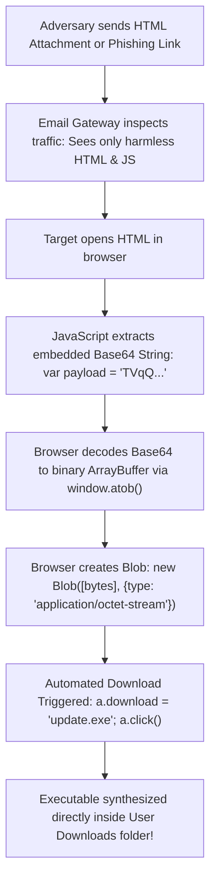

# Base64 Variants, Data URIs, HTML Smuggling & Web Exploitation

> **Deep-Dive Forensic Guide: Embedded Media, Phishing Evasion, Deserialization Gadgets, and Alternative Radices**  
> *Everything security professionals must know about Base64 beyond plain text strings.*

---

## 1. RFC 2397 Data URIs & Embedded Media

The **Data URI scheme** (RFC 2397) allows resource creators to embed small files directly inline within web pages, HTML emails, and style sheets:

```
data:[<mediatype>][;base64],<data>
```

### Common Legitimate Media Schemes
*** PNG Image:** `data:image/png;base64,iVBORw0KGgoAAAANSUhEUg...`
*** JPEG Image:** `data:image/jpeg;base64,/9j/4AAQSkZJRgABAQEA...`
*** SVG Vector:** `data:image/svg+xml;base64,PHN2ZyB4bWxucz0...`
*** PDF Document:** `data:application/pdf;base64,JVBERi0xLjQK...`

### Phishing Evasion via Inline Images
In modern email clients (Outlook, Gmail), images loaded from external URLs (``) are often blocked by default to prevent user tracking.

Attackers bypass this defensive control by converting brand logos, fake Microsoft/Google login banners, and credential-harvesting prompts into inline **Base64 Data URIs**. Because the image is embedded directly in the email HTML body, the email client renders it immediately without reaching out to an external server.

---

## 2. HTML Smuggling (MITRE ATT&CK T1027.006)

HTML Smuggling is one of the most prevalent and effective delivery techniques used by APT groups (e.g., Nobelium, QakBot, Bumblebee).

### The Core Problem: Why Perimeter Defenses Fail
Traditional Next-Generation Firewalls (NGFW), Web Proxies, and Secure Email Gateways (SEG) inspect files as they traverse the network perimeter. If an executable (`.exe`), disk image (`.iso`), or archive (`.zip`) crosses the wire, the gateway intercepts it.

** In an HTML Smuggling attack, no executable ever crosses the network wire.**



### Deconstructing the Client-Side Smuggling Script

```html
<script>
    // 1. Harmless-looking string containing an entire malicious binary
    var b64Payload = "TVqQAAMAAAAEAAAA//8AALgAAAAAAAAAQAA...";
    
    // 2. Decode Base64 string into raw binary octets
    var byteCharacters = atob(b64Payload);
    var byteNumbers = new Array(byteCharacters.length);
    for (var i = 0; i < byteCharacters.length; i++) {
        byteNumbers[i] = byteCharacters.charCodeAt(i);
    }
    var byteArray = new Uint8Array(byteNumbers);
    
    // 3. Assemble binary Blob in browser memory
    var blob = new Blob([byteArray], {type: 'application/octet-stream'});
    
    // 4. Force browser to automatically save file to disk
    var link = document.createElement('a');
    link.href = window.URL.createObjectURL(blob);
    link.download = "Invoice_Q3.iso";
    document.body.appendChild(link);
    link.click();
</script>
```

---

## 3. MIME Type Spoofing: Discrepancy Detection

Adversaries frequently employ **MIME type spoofing** within Data URIs to deceive security scanners and users:

$$\text{Claimed: } \mathbf{\text{data:image/png;base64,TVqQAAMAAAAEAAAA...}}$$

*** The Header Claims:** An innocent PNG image (`image/png`).
*** The Magic Bytes Reveal:** `4D 5A` (`TVq...`), which corresponds to a **Windows Portable Executable (PE)**!

### How B64Lab Flags This Discrepancy
B64Lab's forensic engine inspects both the claimed header and the first 8 decoded bytes. If a mismatch is detected, it raises an instant alert:
```
[!] ALERT: CRITICAL MIME MISMATCH! (HTML Smuggling Indicator T1027.006)
    Claimed to be an image but contains a EXECUTABLE binary!
```

---

## 4. Web Exploitation & Deserialization Magic Signatures

Base64 is the primary transport encoding for serialized runtime objects in web applications. Security analysts and penetration testers look for distinctive Base64 prefixes that immediately indicate exploitable serialization formats:

| Format / Vulnerability | Hex Magic Bytes | Base64 Prefix | Severity / Impact |
| :--- | :--- | :--- | :--- |
| **Java Serialized Object** | `AC ED 00 05` | **`rO0AB...`** | **CRITICAL:** Vulnerable to `ysoserial` gadget chains leading to instant Remote Code Execution (RCE). |
| **ASP.NET ViewState** | `FF 01` | **`/wEP...`** | **HIGH:** If MAC validation is disabled or key is leaked, allows code execution via `ActivitySurrogateSelector`. |
| **Python Pickle Stream** | `80 04` / `80 03` | **`gASV...`** | **CRITICAL:** Python `pickle.loads()` executes arbitrary code via the `__reduce__` method. |
| **X.509 Certificate (DER)** | `30 82` | **`MIIC...` / `MIID...`** | **INFORMATIONAL:** Standard TLS/SSL cryptographic public certificate structures. |

---

## 5. Alternative Radix Encodings in Cybersecurity

Beyond standard Base64, security analysts routinely encounter alternative radix encodings:

```
┌───────────┬──────────────┬────────────────────────┬──────────────────────────────────────────┐
│ Encoding  │ Alphabet     │ Efficiency / Overhead  │ Primary Security Use Cases               │
├───────────┼──────────────┼────────────────────────┼──────────────────────────────────────────┤
│ Base64    │ 64 chars     │ +33.3% size expansion │ MIME, Web APIs, Malware Obfuscation      │
│ Base64URL │ 64 chars     │ +33.3% (no +, /, =)    │ JWT tokens (RFC 7519), OAuth, WebAuthn   │
│ Base32    │ 32 chars     │ +60.0% size expansion │ DNS Exfiltration / C2 Tunneling, TOTP    │
│ Base85    │ 85 chars     │ +25.0% size expansion │ PDF binary streams, Git binary patches   │
│ Base58    │ 58 chars     │ Variable (~33%)        │ Cryptocurrency addresses (no 0, O, I, l) │
│ Base16    │ 16 chars     │ +100.0% (2x size)      │ Hexadecimal memory dumps, byte sequences │
└───────────┴──────────────┴────────────────────────┴──────────────────────────────────────────┘
```

### Why Base85 (Ascii85) Outperforms Base64 in Storage
*** Base64:** Encodes 3 bytes into 4 characters (+33.3% overhead).
*** Base85:** Encodes 4 bytes into 5 characters (+25.0% overhead).
* Because $85^5 = 4,437,053,125 > 2^{32} = 4,294,967,296$, Base85 packs a full 32-bit integer into 5 ASCII characters. It is commonly found when analyzing malicious PDF exploits.

### Why Base32 Dominates DNS Tunneling (C2 Exfiltration)
* DNS hostnames are **case-insensitive** (e.g., `A.evil.com` is identical to `a.evil.com`).
* Standard Base64 relies on case sensitivity (`A` is value 0, `a` is value 26). Sending Base64 through DNS queries corrupts the data.
*** Base32 uses only uppercase letters (`A-Z`) and digits (`2-7`)**, making it resilient across all DNS caching resolvers.
